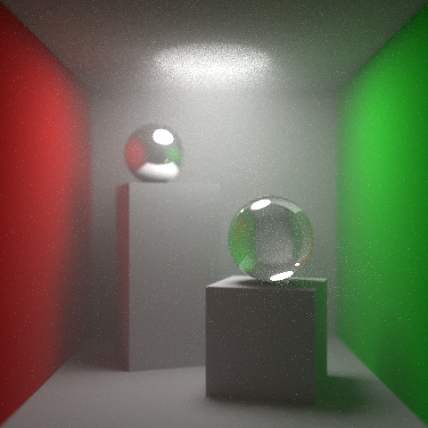
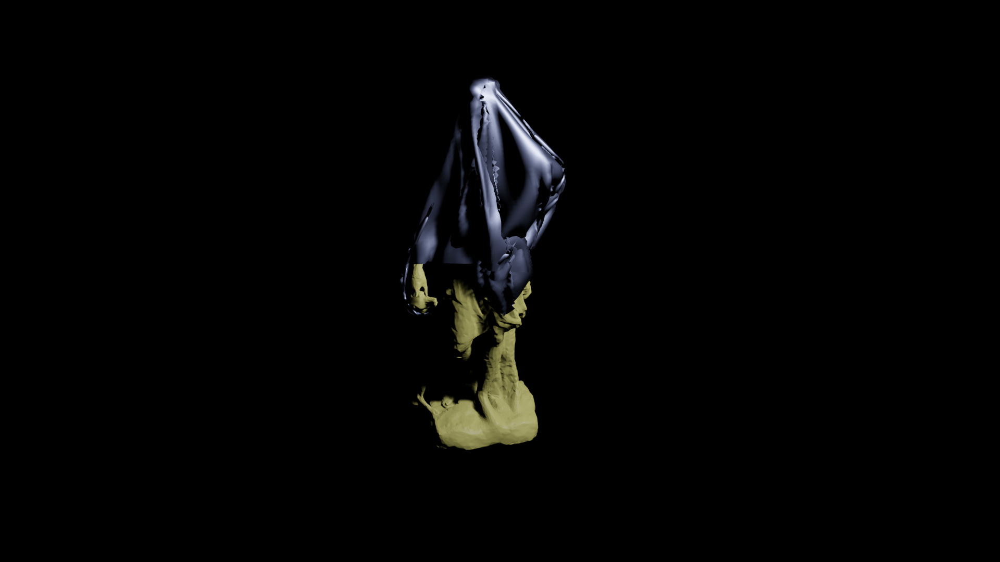

# HW 1. Blender Basics

# HW 2. OpenGL

# HW 3. Geometric modeling

# HW 4. Lignting & shading

# HW 5. RayTracer

# HW 6. Advanced Rendering

# HW 7. Geometry Modeling

# HW 8. Texture mapping

## Final Project

<!-- 
 -->
