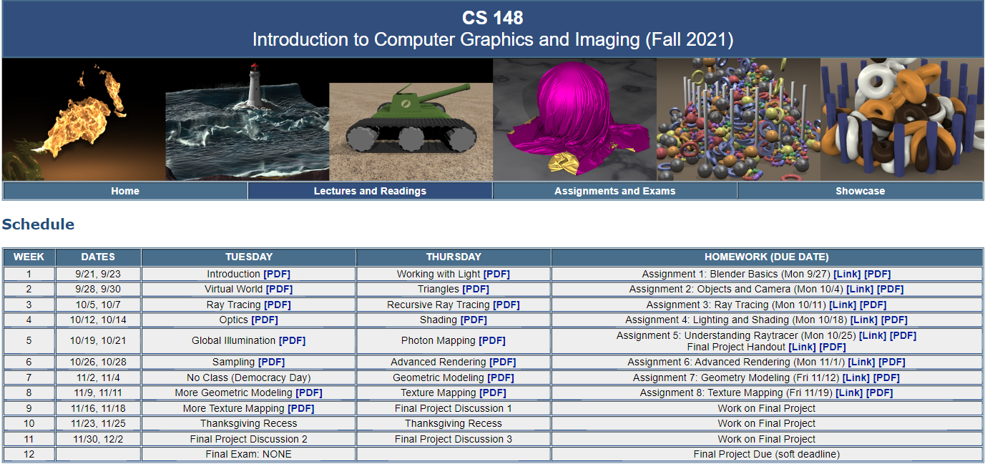

# Stanford CS148 Introduction to Computer Graphics and Imaging

The short course would last 10 weeks for learning

Weekly two courses and one homework would be uploaded and finished.

teached by Ron Fedkiw

Ron Fedkiw awarded an Academy Award from The Academy of Motion Picture Arts and Sciences (twice: 2008 and 2015)

website link: https://web.stanford.edu/class/cs148/assignments.html

//  